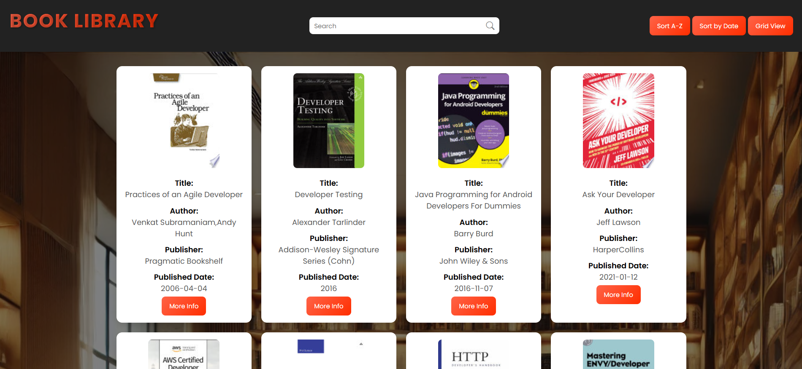

# Book Library

📚 **Overview**  
osyReads is a responsive web application that allows users to browse and search through a collection of books. Built with HTML, CSS, and JavaScript, it offers an intuitive interface for book discovery.

## 🎯 Features

- 🔍 **Search:** Find books by title or author.
- 📖 **Sorting:** Sort books by title (A-Z, Z-A) and publication date.
- 🖼️ **View Modes:** Toggle between grid and list layouts.
- 📄 **Pagination:** Navigate results with customizable page limits.
- 📱 **Responsive Design:** Optimized for all device sizes.

## Screenshots

## Deployment Link

Book Library here: [**Live Demo**](https://book-library-gamma-coral.vercel.app/)

## 🛠️ Technologies Used

- **HTML**
- **CSS**
- **JavaScript**
- **REST API integration**
